<!--
For this README to appear on your GitHub profile, the repository name must be exactly:
Haritha-Sivasankaran
-->


<p align="center">
  
</p>

<p align="center">
  
  
  
  
  
</p>

```js
const haritha = {
  ships: ["products with personality", "smooth user flows", "systems that scale"],
  cares_about: ["clean visuals", "reliable logic", "good developer experience"],
  avoids: ["messy UX", "repeated manual work", "boring builds"]
};
```

## Current Vibe

- Building interfaces that feel clean, fast, and actually intentional.
- Writing logic that still holds up once the UI gets real usage.
- Using automation the second repetitive work starts getting annoying.
- Exploring AI and data ideas that are useful enough to keep shipping.

## Dev Pulse



<p align="center">
  <sub>real data | auto-refreshes every 6 hours | updates on profile repo pushes</sub>
</p>

<p align="center">
  <strong>terminal open. tabs everywhere. still shipping.</strong>
</p>
