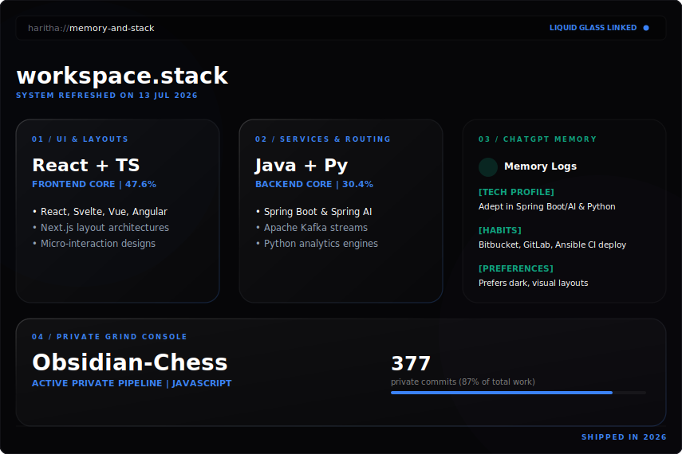

<!--
For this README to appear on your GitHub profile, the repository name must be exactly:
Haritha-Sivasankaran
-->

  

  
  
  
  
  

## Main Character Build

## Build Receipts

  real data | auto-refreshes every 6 hours | updates on profile repo pushes

  <strong>terminal open. tabs everywhere. still shipping.</strong>

