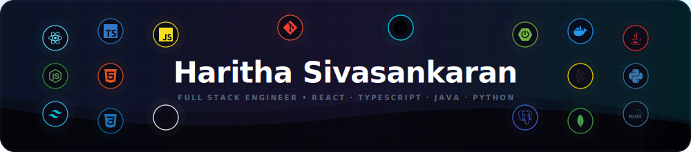

<!--
For this README to appear on your GitHub profile, the repository name must be exactly:
Haritha-Sivasankaran
-->

  

## 🎧 2026 Developer Wrapped

---

## 🛠️ System Stack & Memory Logs

---

## 📊 Nothing OS Commit Tempo

---

### 🎛️ Core Capabilities

* **Frontend**: React, Angular, Vue.js, Svelte, Next.js, TypeScript, JavaScript, HTML5 & CSS3, TailwindCSS, Responsive Layouts
* **Backend**: Java, Spring Boot, Spring AI, Python, Node.js, Express.js, RESTful APIs, Message Brokers (Apache Kafka), RabbitMQ, IBMQ
* **DevOps & DBs**: PostgreSQL, MySQL, MongoDB, Docker, Git, GitHub Actions, Bitbucket, GitLab, Ansible

---

  Data dynamically updated every 6 hours via GitHub Actions workflows.

