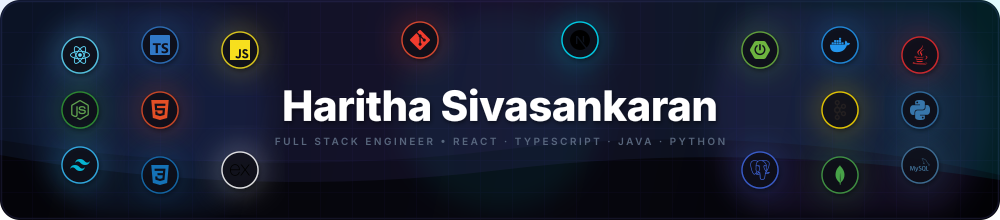

<!--
For this README to appear on your GitHub profile, the repository name must be exactly:
Haritha-Sivasankaran
-->

  

  
  &nbsp;&nbsp;
  

**Full-Stack Software Engineer** &nbsp;•&nbsp; Distributed Systems & Real-Time Interfaces  
*React &bull; TypeScript &bull; Java &bull; Spring Boot &bull; Python &bull; Apache Kafka*

---

### 💡 About Me

I am a full-stack engineer focused on architecting resilient backend services, event-driven pipelines, and intuitive, fluid user experiences. I specialize in building end-to-end systems across the modern JavaScript/TypeScript ecosystem, Java enterprise layers (Spring Boot & Spring AI), and Python data services.

- 🔭 **Current Focus**: Designing high-throughput event streaming architectures and real-time telemetry dashboards.
- ⚙️ **Backend & Cloud**: Java (Spring Boot, Spring AI), Python, Node.js, RESTful microservices, and Docker containerization.
- 🎨 **Frontend Craft**: React, TypeScript, Next.js, and modern component systems with strict layout fidelity.
- ⚡ **Asynchronous Messaging**: Event-driven streaming with Apache Kafka & RabbitMQ.
- 🧠 **Engineering Principles**: Clean architecture, test-driven reliability, modularity, and automated CI/CD pipelines.

---

### 🛠️ Technical Arsenal

<table>
  <tr>
    <td width="22%"><b>Frontend</b></td>
    <td>
      
      
      
      
      
      
      
      
      
      
    </td>
  </tr>
  <tr>
    <td><b>Backend & APIs</b></td>
    <td>
      
      
      
      
      
      
      
    </td>
  </tr>
  <tr>
    <td><b>Data & Messaging</b></td>
    <td>
      
      
      
      
      
    </td>
  </tr>
  <tr>
    <td><b>DevOps & Tooling</b></td>
    <td>
      
      
      
      
      
      
    </td>
  </tr>
</table>

---

### 🚀 Featured Highlights

<table>
  <tr>
    <td width="50%" valign="top">
      <h3 align="left">🚆 TransitPulse 2.0</h3>
      
Live public transit tracking and notifications engine powered by Kafka event streams, Node.js, and a responsive React telemetry dashboard.

      

        
        
        
      

      

        <a href="https://github.com/Haritha-Sivasankaran/TransitPulse-2.0"><b>Explore Repository &rarr;</b></a>
      

    </td>
    <td width="50%" valign="top">
      <h3 align="left">♟️ Obsidian Chess</h3>
      
An offline-first modular chess engine built in vanilla JavaScript featuring custom AI move analysis, undo/redo state trees, and localized board themes.

      

        
        
        
      

      

        <a href="https://github.com/Haritha-Sivasankaran/Obsidian-Chess"><b>Explore Repository &rarr;</b></a>
      

    </td>
  </tr>
</table>

---

### 📊 Live Workspace Telemetry

  

  ⚡ Telemetry dynamically computed and synchronized every 6 hours via GitHub Actions.

---

  <a href="https://www.linkedin.com/in/haritha-sivasankaran/">LinkedIn</a> &nbsp;&bull;&nbsp;
  <a href="https://github.com/Haritha-Sivasankaran">GitHub</a> &nbsp;&bull;&nbsp;
  <a href="https://Haritha-Sivasankaran.github.io/Haritha-Sivasankaran/">Interactive Telemetry Web App</a>

