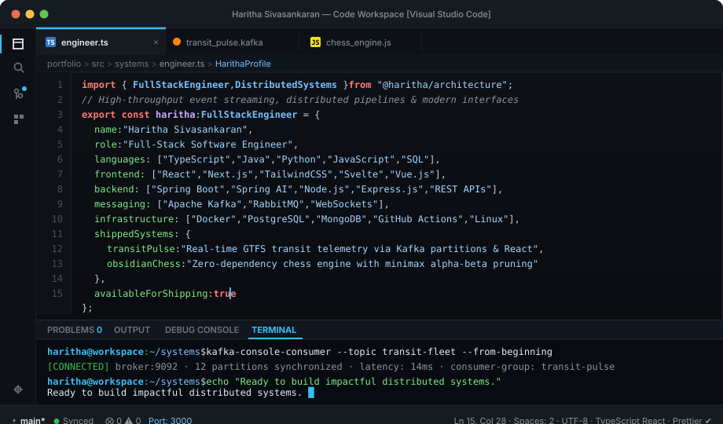

<!--
For this README to appear on your GitHub profile, the repository name must be exactly:
Haritha-Sivasankaran
-->

  

  
  &nbsp;&nbsp;
  

  

 

  <a href="https://github.com/Haritha-Sivasankaran/TransitPulse-2.0"><b>TransitPulse 2.0</b></a> &nbsp;&bull;&nbsp;
  <a href="https://github.com/Haritha-Sivasankaran/Obsidian-Chess"><b>Obsidian Chess</b></a> &nbsp;&bull;&nbsp;
  <a href="https://Haritha-Sivasankaran.github.io/Haritha-Sivasankaran/"><b>Interactive Telemetry Dashboard</b></a> &nbsp;&bull;&nbsp;
  <a href="https://www.linkedin.com/in/haritha-sivasankaran/"><b>LinkedIn</b></a>

